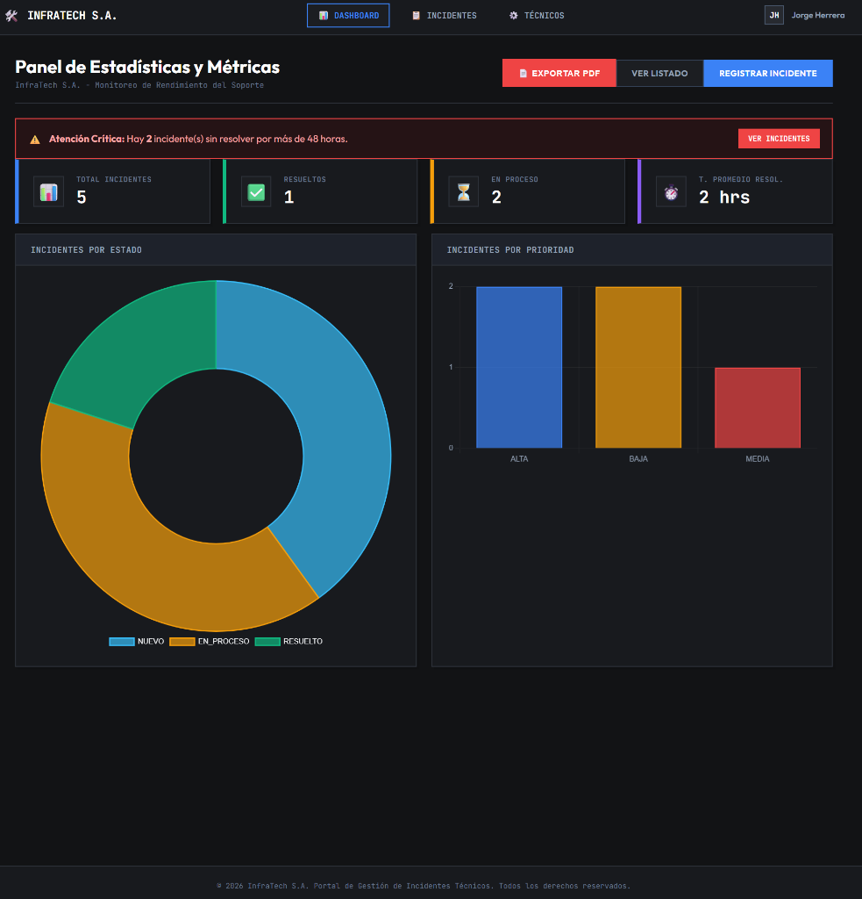
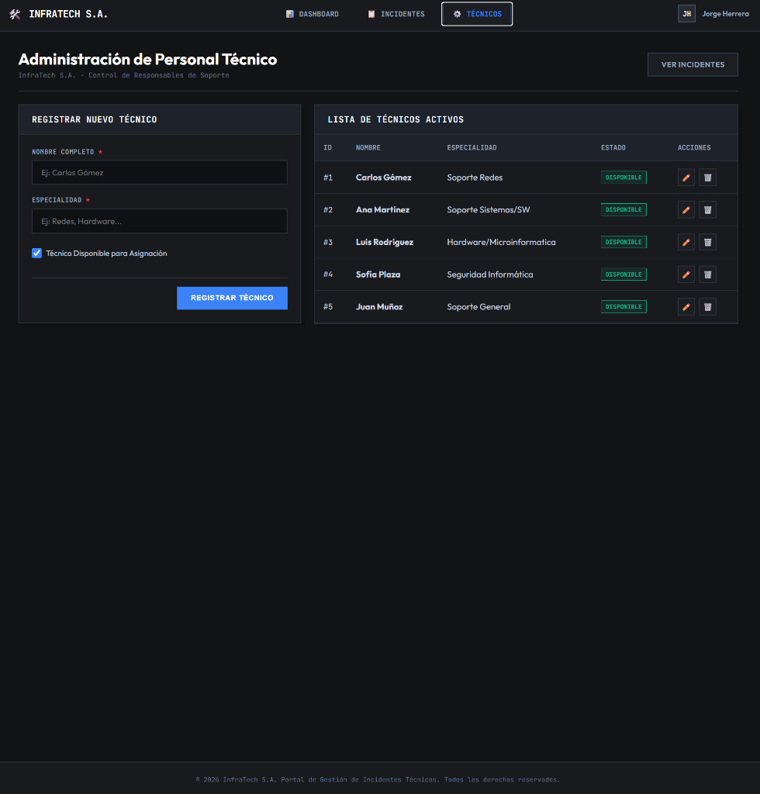
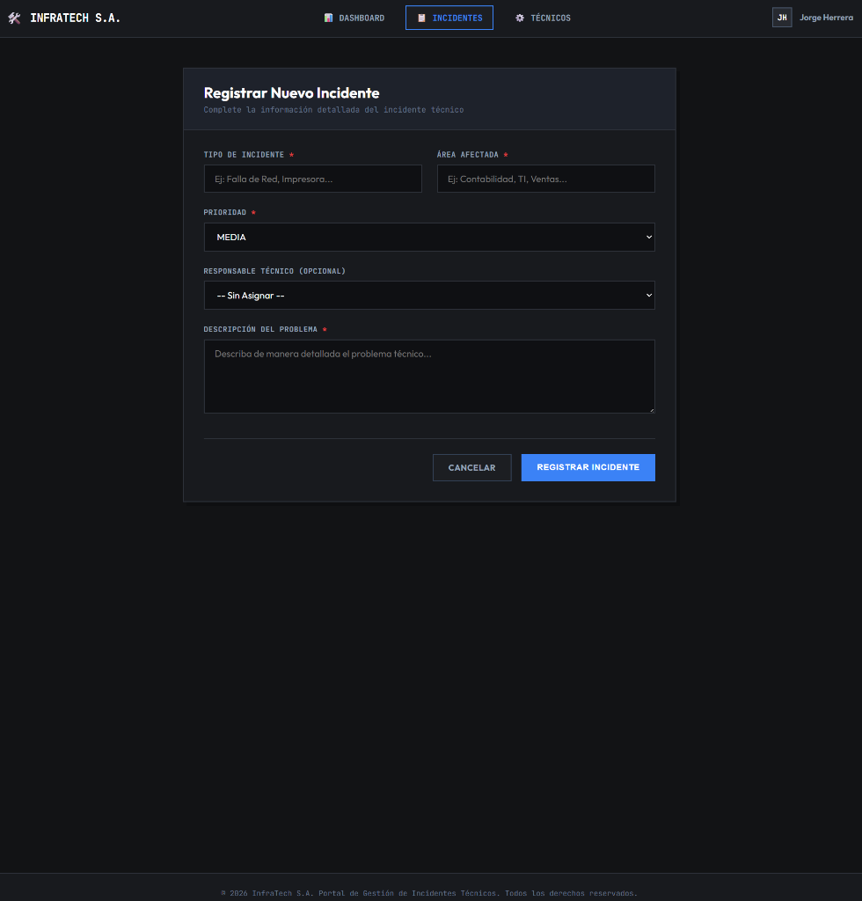

# 🛠️ Portal de Gestión de Incidentes — InfraTech S.A.

Portal interno para la gestión integral de incidentes técnicos. Permite registrar, asignar, resolver y filtrar incidentes, visualizar estadísticas de rendimiento del soporte técnico y exportar reportes en PDF.

> **Desarrollado por:** Jorge Kevin Herrera Centellas  
> **Repositorio:** [KherCent/solemne-2-appweb](https://github.com/KherCent/solemne-2-appweb)

---

## 📸 Capturas de Pantalla

### Panel de Estadísticas y Métricas


### Administración de Técnicos


### Registro de Nuevo Incidente


---

## 🏗️ Arquitectura del Proyecto

```
solemne-2-appweb/
├── backend/          # Spring Boot 3 + JPA + PostgreSQL
├── frontend/         # Angular 17 (standalone components)
├── docs/
│   └── screenshots/  # Capturas de pantalla de la aplicación
└── docker-compose.yml
```

| Capa | Tecnología | Puerto |
|------|-----------|--------|
| Base de datos | PostgreSQL 15 | 5433 (host) |
| Backend API | Spring Boot 3 / Java 17 | 8090 (host) |
| Frontend | Angular 17 + Nginx | 80 (host) |

---

## ✨ Funcionalidades

- 📋 **Listado de incidentes** con filtros por tipo, estado, prioridad y rango de fechas
- 📊 **Dashboard estadístico** con gráficos de distribución por estado y prioridad
- 🚨 **Alertas críticas** para incidentes sin resolver por más de 48 horas
- 👷 **CRUD de técnicos** con asignación dinámica a incidentes
- 📄 **Exportación PDF** del listado de incidentes
- 📱 **Diseño responsive** con menú hamburguesa para dispositivos móviles

---

## 🚀 Cómo Ejecutar el Proyecto

### Requisitos Previos
- [Docker](https://www.docker.com/) y Docker Compose instalados

### Ejecución con Docker (Recomendado)

```bash
# Clonar el repositorio
git clone https://github.com/KherCent/solemne-2-appweb.git
cd solemne-2-appweb

# Levantar todos los servicios
docker compose up --build
```

Una vez que los contenedores estén listos, acceder a:

| Servicio | URL |
|----------|-----|
| **Frontend** | http://localhost |
| **Backend API** | http://localhost:8090/api |
| **PostgreSQL** | `localhost:5433` (usuario: `postgres`, pass: `postgres`) |

### Detener los servicios

```bash
docker compose down
```

---

## 📡 Endpoints API

| Método | Endpoint | Descripción |
|--------|----------|-------------|
| `GET` | `/api/incidents` | Listar incidentes (con filtros opcionales) |
| `POST` | `/api/incidents` | Crear nuevo incidente |
| `PUT` | `/api/incidents/{id}` | Actualizar incidente |
| `PUT` | `/api/incidents/{id}/assign` | Asignar técnico |
| `PUT` | `/api/incidents/{id}/status` | Cambiar estado |
| `DELETE` | `/api/incidents/{id}` | Eliminar incidente |
| `GET` | `/api/incidents/stats` | Obtener estadísticas |
| `GET` | `/api/technicians` | Listar técnicos |
| `POST` | `/api/technicians` | Registrar técnico |
| `PUT` | `/api/technicians/{id}` | Actualizar técnico |
| `DELETE` | `/api/technicians/{id}` | Eliminar técnico |

---

## 🔧 Variables de Entorno (Backend)

| Variable | Valor por defecto |
|----------|------------------|
| `DB_HOST` | `db` |
| `DB_PORT` | `5432` |
| `DB_NAME` | `incidentdb` |
| `DB_USER` | `postgres` |
| `DB_PASSWORD` | `postgres` |

---

*© 2026 InfraTech S.A. — Todos los derechos reservados.*
